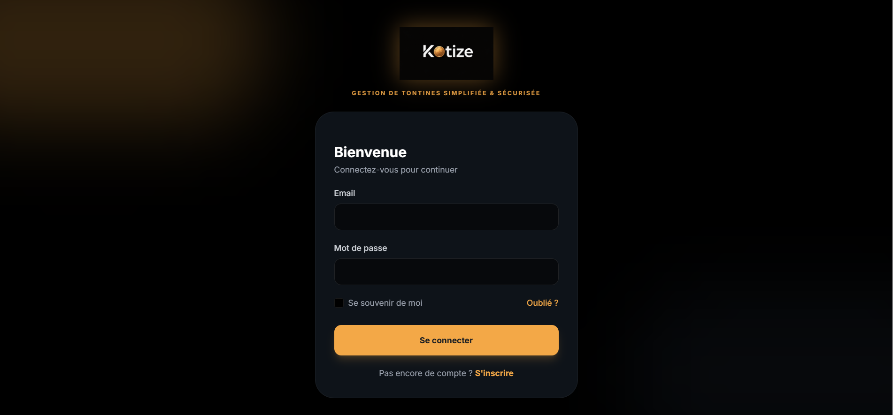
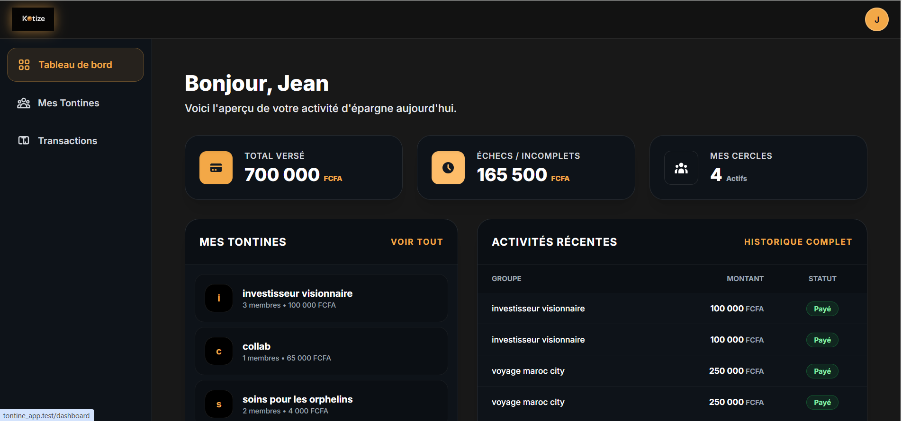
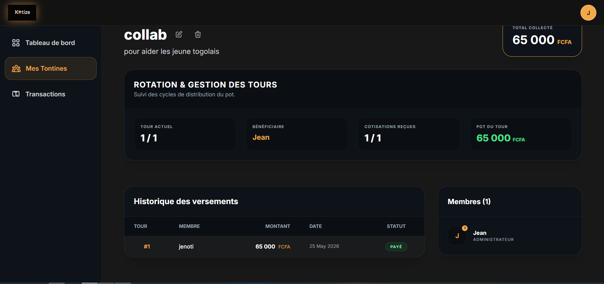

## 📌 About the Project

**Tontine App** est une application web communautaire de gestion de tontines développée avec Laravel.

Elle permet à des utilisateurs de créer des groupes de tontine, de suivre les contributions des membres et de gérer les tours de paiement de manière simple et transparente.

Cette version est une **V1 en cours de développement** et peut encore contenir des améliorations ou des fonctionnalités incomplètes.

---

## 📸 Screenshots

### 🔐 Page d'inscription

### 📊 Dashboard

### 💰 Gestion des tontines

---

## ⚙️ Features

- Création de compte utilisateur
- Authentification sécurisée
- Création et gestion de groupes de tontine
- Suivi des contributions
- Tableau de bord utilisateur

---

## 🚧 Status

Version actuelle : **V1 (Development)**
- Certaines fonctionnalités sont encore en amélioration
- Le projet évolue progressivement

---

## 🛠️ Built With

- Laravel
- PHP
- MySQL
- Blade Templates
- HTML / CSS / JS

---

## 📌 Note

Ce projet est open source et destiné à évoluer avec la contribution de la communauté développeur.

---

## 📄 License

MIT Licenserced software licensed under the [MIT license](https://opensource.org/licenses/MIT).
